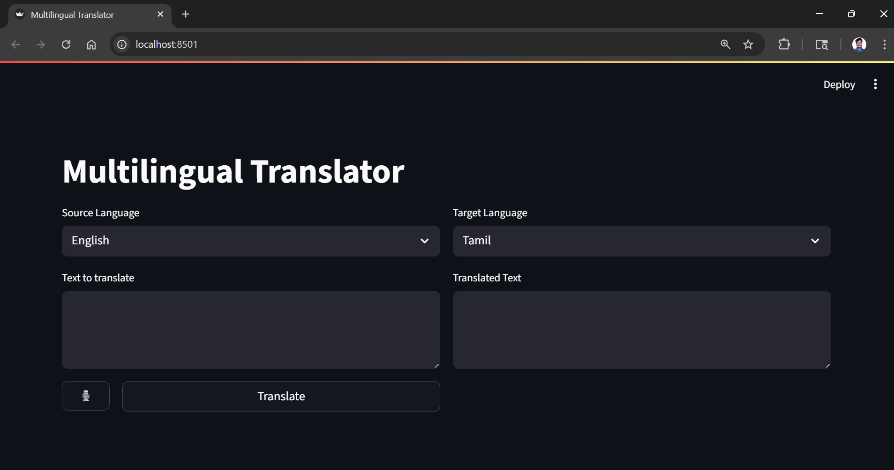
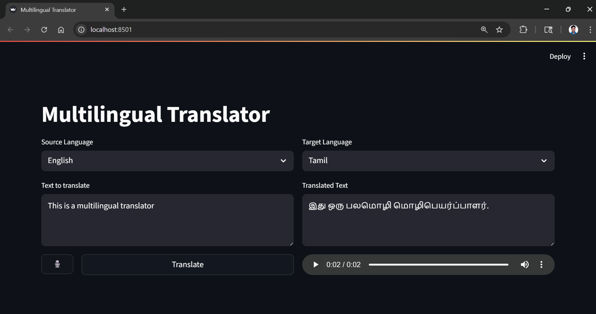

# 🌐 Multilingual Translator

**Multilingual Translator** a real-time multilingual translation application that allows users to speak or type in one language and receive an instant translation in another, optionally with audio output. It supports 20+ languages and enables smooth, conversational interaction through a clean **Streamlit** interface. The backend is built with **Flask** and uses **OpenAI's LLMs** for high-quality translation and text-to-speech synthesis. 

I split frontend and backend to keep roles clean and reliable: Streamlit handles UX, while Flask exposes APIs, runs model calls, and serves files. Flask is better for binary uploads and static MP3s, and it avoids Streamlit’s rerun issues during long ops. Keeping logic in Flask stabilizes state, centralizes secrets, and keeps credentials out of the UI. The same API can power other clients later. HTTP GET/POST also handles large inputs and file uploads cleanly.




## 🎯 Features

* 🎙️ **Voice Input (STT)**: Record from mic and auto-fill the input box on stop.
* 🔤 **Text-to-Text Translation**: Deterministic translations between major languages.
* 🔊 **Text-to-Speech Output**: Generate MP3 audio for the translated text.
* 🌍 **20+ Languages**: Quick source/target selection via side-by-side dropdowns.
* ⚡ **Real-time UI**: Immediate transcript update; mic and Translate on one line.
* 🖥️ **Streamlit Frontend**: Clean, responsive interface.
* 🔗 **Flask Backend API**: `/stt` for speech→text, `/translate` for text→translation+MP3, `/audio/<file>` for playback.

## Model Used:

1. Speech-to-Text: ```Wishper-1```
2. Text-to-Text: ```gpt-4o-mini```
3. Text-to-Speech: ```gpt-4o-mini-tts (voice: alloy)```

## Architecture Overview

```
                 ┌──────────────────────────────┐
                 │          Streamlit UI        │
                 │  - Textarea (key="inp")      │
 User speaks     │  - ⏺️/⏹️ mic button         │
 ──stop────────▶│  - Source/Target dropdowns   │
                 │  - Translate button          │
                 └───────┬───────────┬──────────┘
                         │           │
             POST /stt   │           │   GET /translate?input_text
           (audio bytes) │           └──────────────────────────────────────────────┐
                         │                                                          │
                         ▼                                                          ▼
                 ┌───────────────────┐                                   ┌─────────────────────────┐
                 │   Flask API       │                                   │      Flask API          │
                 │   /stt            │                                   │     /translate          │
                 │ - Whisper STT     │                                   │ - GPT-4o-mini translate │
                 │   → {text}        │                                   │ - gpt-4o-mini-tts MP3   │
                 └────────┬──────────┘                                   │ - save → /audio/*.mp3   │
                          │                                              └───────────┬─────────────┘
                          │                                                          │
        set st.session_state["inp"] ◀────────────── JSON { text }                   │
                          │                                                          │
                          ▼                                                          ▼
                 ┌──────────────────────────────┐                       JSON { translated_text,
                 │      Streamlit Output        │                            audio_url:/audio/… }
                 │  - Translated textarea ◀──────────────────────────────────────────┐
                 │  - st.audio player     ◀─────────────┐                            │
                 └──────────────────────────────┘        │                            │
                                                         ▼                            ▼
                                               ┌────────────────────┐      ┌──────────────────────┐
                                               │  Flask /audio/<id> │◀────┤ MP3 files on disk     │
                                               │  serves audio/mpeg │      └──────────────────────┘
                                               └────────────────────┘

```

## 📸 Model Outcome



## Author

👤 **[Vetrivel Maheswaran](https://github.com/Vetrivel07)**

## Connect With Me 🌐

**[](https://www.linkedin.com/in/vetrivel-maheswaran/)**

**[](https://vetrivel07.github.io/vetrivel-maheswaran)**

<p align="center"><b>© Created by Vetrivel Maheswaran</b></p?